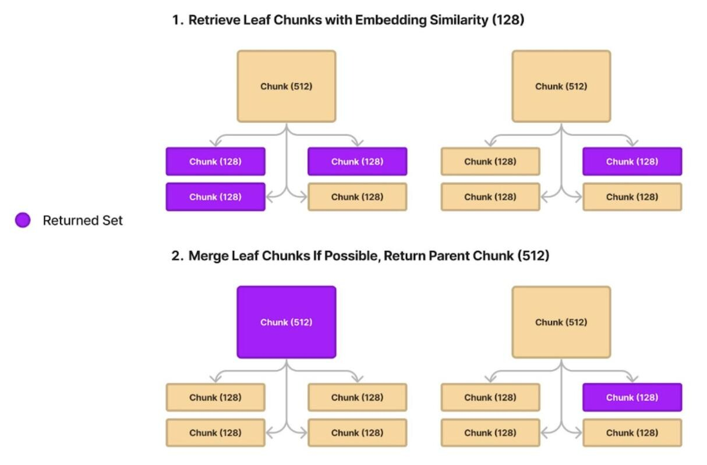
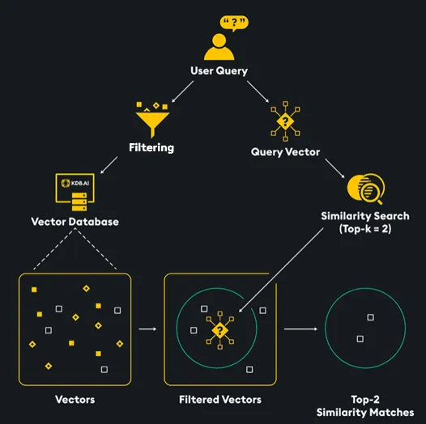

## GDPR-Index

(To properly view this file, please load with a markdown extension if viewing in VS code or other supported IDE)

Welcome to the GDPR-Index! You can use this tool to query a GDPR document in natural language.

This is powered by the OpenAI GPT-4 model and Retrieval Augmented Generation, and built with LlamaIndex.

## How it works:

#### Chunking and Retrieval:

- We use an auto merging technique for chunking and retrieval that maintains a hierarchy of chunks, allows to capture the full context and is not limited to an arbitrary length of token like naive retrieval methods.
- Firstly, we split the articles into larger text chunks (e.g., size 512), then further subdivide these into smaller "child" chunks (e.g., size 128).
- During querying, we begin with smaller chunk retrieval via embedding similarity; return the parent chunk if the majority of a subset is selected, otherwise return only the selected child chunks.
 

#### Embedding:

- We create a numerical representation of the text in each chunk with an embedding model (BAAI/bge-small-en-v1.5) that is stored in a local vector database.
- At inference time, user query is also embedded using the same model and compared with the relevant chunks in the database to identify chunk that are most similar to the query and hence contain the information required to generate the response.

#### Retrieval and Generation:

- Once user submits a query, its embedding is created, top similar chunks are retreived and provided as context to the LLM to generate a response.

#### Reranking:

- After retrieving the chunks we also use a reranker model to rerank and select the top 2 chunks based on relevance to the user query. This allows for a wider search in the vector index with cosine similarity and then narrowing on the most relevant text using a specialised reranking model.

#### Metadata filtering with doc summaries:

- We use the summaries provided for each article to find the articles that are most relevant for a user query
- While creating the vector index, we add in the article number and article summary as a metadata to each chunk
- During retrieval the chunks from these top 3 relevant articles are then prioritised for retrieval, reducing the search space

#### Evaluation:

- The response generated by the RAG system is evaluated for Answer relevance, Context relevance and Groundedness. This is implemented using Trulens Eval.
- Trulens uses the LLM as a judge approach to generate the metrics traid by evaluating the query, context retrieved and response. OpenAI LLM is used for this evaluation.

## Modules and Scripts:

 - gdpr_split.py: Splits the GDPR pdf into txt files, where each files contains an article of the GDPR, named with article no
 - utils.py: Contains the util functions to load the article summaries, build/load auto merging index and engine, evaluation functions with Trulens_eval
 - summary_matcher.py: Uses a sentence transformer model to generate similarity scores between user query and article summaries. Returns top 3 article numbers which have summaries most similar to the query
 - ingest.py: Script to load the articles text files and generate a vector index
 - query.py: Main script that user can interact with to ask questions and get a response based on retrieval from the vector index. Also prints source articles and evaluation of the response

#### How to use:

- Create a new python env: 
- If starting from the pdf file, run gdpr_split.py to generate article text files
